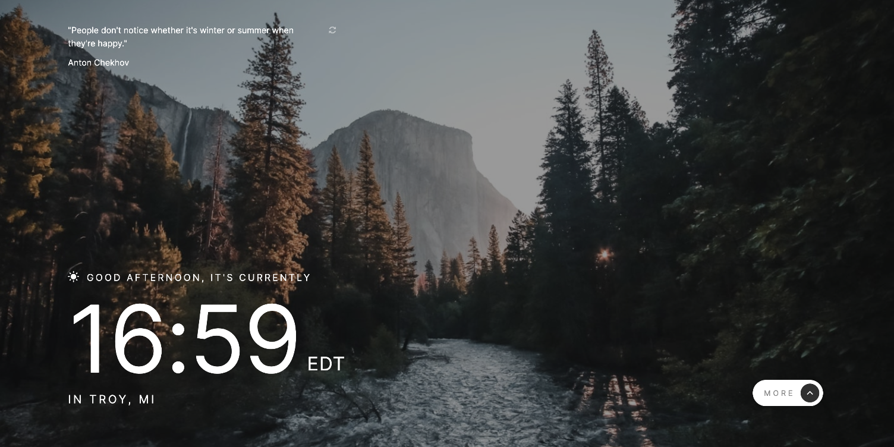

# Frontend Mentor - Clock

This is a solution to the [Clock app challenge on Frontend Mentor](https://www.frontendmentor.io/challenges/clock-app-LMFaxFwrM). Frontend Mentor challenges help you improve your coding skills by building realistic projects.

## Table of contents

- [Overview](#overview)
  - [The challenge](#the-challenge)
  - [Screenshot](#screenshot)
  - [Links](#links)
- [My process](#my-process)
  - [Built with](#built-with)
  - [What I learned](#what-i-learned)
- [Author](#author)

## Overview

### The challenge

Users should be able to:

- View the optimal layout for the site depending on their device's screen size
- See hover states for all interactive elements on the page
- View the current time and location information based on their IP address
- View additional information about the date and time in the expanded state
- Be shown the correct greeting and background image based on the time of day they're visiting the site
- Generate random quotes by clicking the refresh icon near the quote

### Screenshot

### Links

- Live Site URL: [link](https://clock-neon-ten.vercel.app/)

## My process

### Built with

- React (used useState and useEffect hooks)
  - First time using styled-components
  - First time using react-loader-spinner
- Made API calls within useEffect hook
- Flexbox for layouts
- JSX for markups in react components
- Desktop-first workflow with media queries for mobile

### What I learned

This was my first attempt at building a React component with hooks and calling an API.

This was also my first time using Styled Components and I really like having the styling in the JS files. I also think the way Styled Components handles themes and global styles is a lot more familiar to what I'm used to working with when building a more standard HTML/CSS page.

## Author

- Website - [Jeff Jakinovich](http://jeffjakinovich.com/)
- Frontend Mentor - [@jljakin2](https://www.frontendmentor.io/profile/jljakin2)
- LinkedIn - [Jeff Jakinovich](https://www.linkedin.com/in/jeff-jakinovich-b6b14943/)
